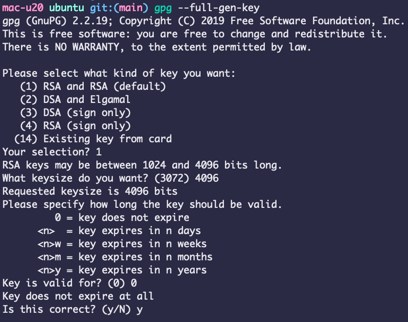

## Personal Package Archive (PPA)

This repository provides a simple way to distribute and install custom Ubuntu packages using GitHub Pages.


### How to Use

#### To add this PPA to your system and install packages:

```shell
curl -fsSL https://minhanghuang.github.io/ppa/ubuntu/KEY.gpg | sudo gpg --dearmor -o /usr/share/keyrings/minhanghuang-archive-keyring.gpg
echo "deb [signed-by=/usr/share/keyrings/minhanghuang-archive-keyring.gpg] https://minhanghuang.github.io/ppa/ubuntu ./" | sudo tee /etc/apt/sources.list.d/minhanghuang.list
sudo apt update
sudo apt search gflag
```

### How to Set Up Your Own PPA

1. Install Required Tools

Ensure your system has the necessary tools installed:

```shell
sudo apt install -y gnupg apt-utils
```

2. Create a GitHub Repository

Create a new GitHub repository, e.g., `ppa`.

3. Configure GitHub Pages

- Go to your repository settings.

- Navigate to the Pages section.

- Set the source to main branch.

4. Generate a GPG Key

```shell
cd ppa
mkdir -p ubuntu
```

Generate a new GPG key



```shell
gpg --full-gen-key
```

Choose RSA and RSA (default)

```shell
Your selection? 1
```

Select 4096-bit key size

```shell
What keysize do you want? (3072) 4096
```

Set the key to never expire
```shell
Real name: <Your Name>
Email address: <your.email@example.com>
```

5. Create the GPG Public Key File

Export the GPG public key to your repository:

```shell
cd ppa/ubuntu
```
```shell
gpg --armor --export "<your.email@example.com>" > KEY.gpg
```

6. Generate Packages and Index Files

```shell
dpkg-scanpackages --multiversion . > Packages
gzip -k -f Packages
```

7. Create Release Files

```shell
apt-ftparchive release . > Release
gpg --default-key "<your.email@example.com>" -abs -o - Release > Release.gpg
gpg --default-key "<your.email@example.com>" --clearsign -o - Release > InRelease
```

8. Create the Repository List File

```shell
echo "deb https://<your-github-username>.github.io/ppa/ubuntu ./" > minhanghuang.list
```

### How to Add New Packages

To add a new .deb package, simply place it in the `ppa/ubuntu` directory and run:

```shell
cp xxx.deb ppa/ubuntu
```

```shell
cd ppa/ubuntu
dpkg-scanpackages --multiversion . > Packages
gzip -k -f Packages

apt-ftparchive release . > Release
gpg --default-key "${EMAIL}" -abs -o - Release > Release.gpg
gpg --default-key "${EMAIL}" --clearsign -o - Release > InRelease
```

### Final Steps

- Commit and push all generated files to your GitHub repository.

- Ensure GitHub Pages is properly serving the repository.

- Users can now add your PPA and install your packages via apt
